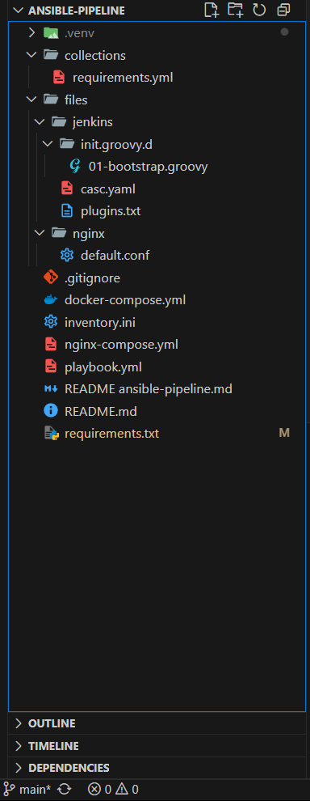
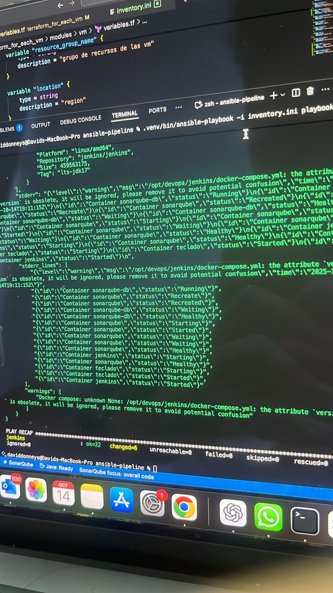

# ansible-pipeline

Playbook para aprovisionar la infraestructura de CI/CD del taller sobre una sola VM:

- **Host `jenkins`**: instala Docker Engine, levanta un stack compuesto por Jenkins LTS (JDK17), SonarQube 9.9 LTS, PostgreSQL 15 y un contenedor Nginx que sirve la aplicación estática `Teclado`. Configura Jenkins con plugins críticos, crea el usuario administrador y registra la instancia Sonar.

## Estructura de carpetas



## Requisitos previos en la máquina de control

1. Python 3.10+ con `pip` disponible.
2. Crear un entorno virtual (recomendado para evitar conflictos del sistema):

```bash
python3 -m venv .venv
source .venv/bin/activate
```

3. Instalar dependencias Python para Ansible:

```bash
pip install -r requirements.txt
```

4. Instalar colecciones de Ansible necesarias:

```bash
ansible-galaxy collection install -r collections/requirements.yml
```

5. Asegurar `rsync` en la máquina de control y que el playbook pueda instalarlo en la VM Ubuntu (se encarga automáticamente si falta).

## Inventario

El inventario mínimo contiene únicamente el grupo `jenkins`:

```ini
[jenkins]
jenkins ansible_host=XX.XX.XX.XX ansible_user=adminuser \
  ansible_ssh_private_key_file=/ruta/completa/.ssh/taller_devops \
  ansible_ssh_common_args='-o StrictHostKeyChecking=no'
```

> Reemplaza `XX.XX.XX.XX` con la IP pública generada por Terraform.

## Variables de entorno útiles

- `JENKINS_ADMIN_ID`: usuario administrador inicial de Jenkins (`admin` por defecto).
- `JENKINS_ADMIN_PASSWORD`: contraseña del administrador.
- `SONAR_ADMIN_TOKEN`: token PAT de SonarQube para crear la credencial `sonarqube-admin-token` en Jenkins.

Puedes sobreescribir cualquier valor con `-e VAR=valor` o inventario por host/grupo.

## Ejecución

```bash
# desde la carpeta ansible-pipeline/
.venv/bin/ansible-playbook -i inventory.ini playbook.yml
```

**Evidencia de ejecución**  


## Resultado esperado

- Jenkins en `http://<IP_JENKINS>:8080` con el usuario y contraseña definidos.
- SonarQube en `http://<IP_JENKINS>:9000` (usando PostgreSQL interno).
- Nginx sirviendo la aplicación `Teclado` en `http://<IP_JENKINS>` (puerto 80).
- Jenkins configurado con plugins: Configuration as Code, SonarQube, Pipeline, Blue Ocean, Git, Docker Workflow, NodeJS, etc.
- Credencial `sonarqube-admin-token` creada automáticamente si defines `SONAR_ADMIN_TOKEN`.

## Pruebas rápidas (smoke tests)

```bash
# estado de servicios en la VM
ssh -i ~/.ssh/taller_devops adminuser@<IP_JENKINS> "docker ps"

# endpoints
curl -I http://<IP_JENKINS>
curl -I http://<IP_JENKINS>:8080/login
curl -I http://<IP_JENKINS>:9000
```

## Errores comunes

- **PING/SSH bloqueado**: revisa el NSG creado por Terraform y `admin_cidr_blocks`.
- **Falla instalando Docker**: ejecuta `sudo journalctl -u docker -xe` en la VM y verifica espacio en disco.
- **Timeout al levantar SonarQube**: primera inicialización puede tardar ~2–3 min; valida `docker logs sonarqube`.

## Despliegue de la app Teclado

El playbook sincroniza el directorio `../Teclado/` a `/opt/devops/jenkins/teclado/site/` y el contenedor `teclado` de Nginx sirve esos archivos en el puerto 80 de la IP pública. Para redeploy:

```bash
# cambia archivos en ../Teclado y vuelve a ejecutar el playbook
.venv/bin/ansible-playbook -i inventory.ini playbook.yml
```
